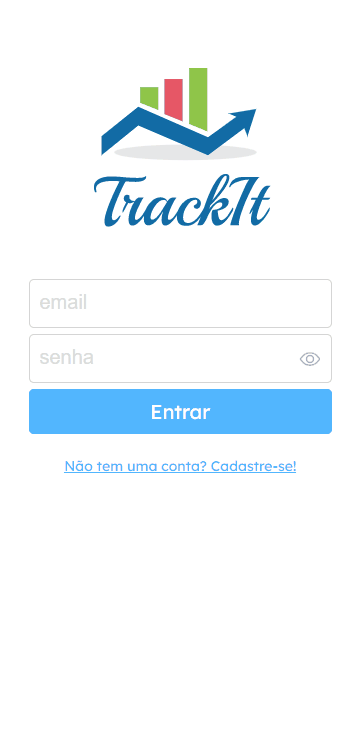

# Trackit

An easier way to control your daily habits! Create, manage and everything to improve your routine! 
      
 

     
    <a href="https://github.com/vinicbarros/TrackIt"><strong>View the files here</strong></a>
     
    <a href="https://trackit-blue-three.vercel.app">View Demo here!</a>
     
  

This is an web application with which lots of people can manage their own habits. Below are the implemented features:

- Sign Up
- Login
- List all habits created of the user
- Add new habit
- Delete habits
- Calendar

By using this app any user can improve your routine by managing and controling the habits daily.
  
## Technologies
The following tools and frameworks were used in the construction of the project: 

  
  
  
  

